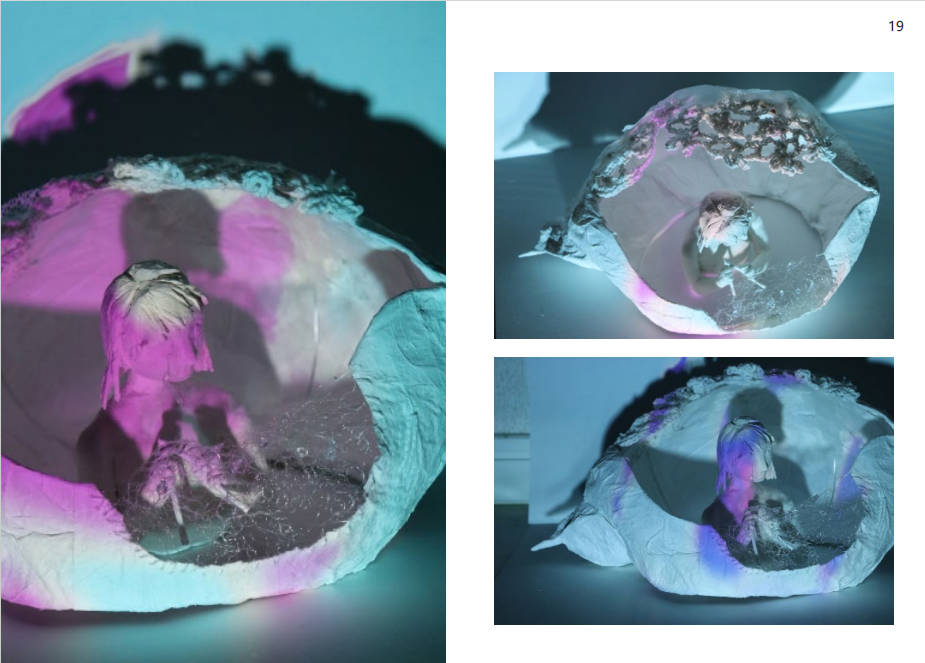

# mint.github.io
# チョウマンソウのポートフォリオ

markdownの使い方

# 自己紹介

 チョウ・マンソウ (ZHANG MANCAO) 
 中国・広東省出身
　　 これまでは主に、インタラクティブアートの制作に携わってきました。楽器演奏の可視化や、表情の変化に反応するインタラクション作品などがその代表例です。また、UIデザインの分野においては、「使いやすさ」と「楽しさ」が共存するデザインを心がけています。
　　 趣味は編み物です。初心者がより簡単に作品作りを楽しめるような制作プロセスの研究も進めています。生成AIに関しては現在学習中ですが、テクノロジーによってどのような新しい表現やアイデアが生まれるのか、その可能性に強い関心を持っています。

## 作品展示
裏と表

## 趣味
